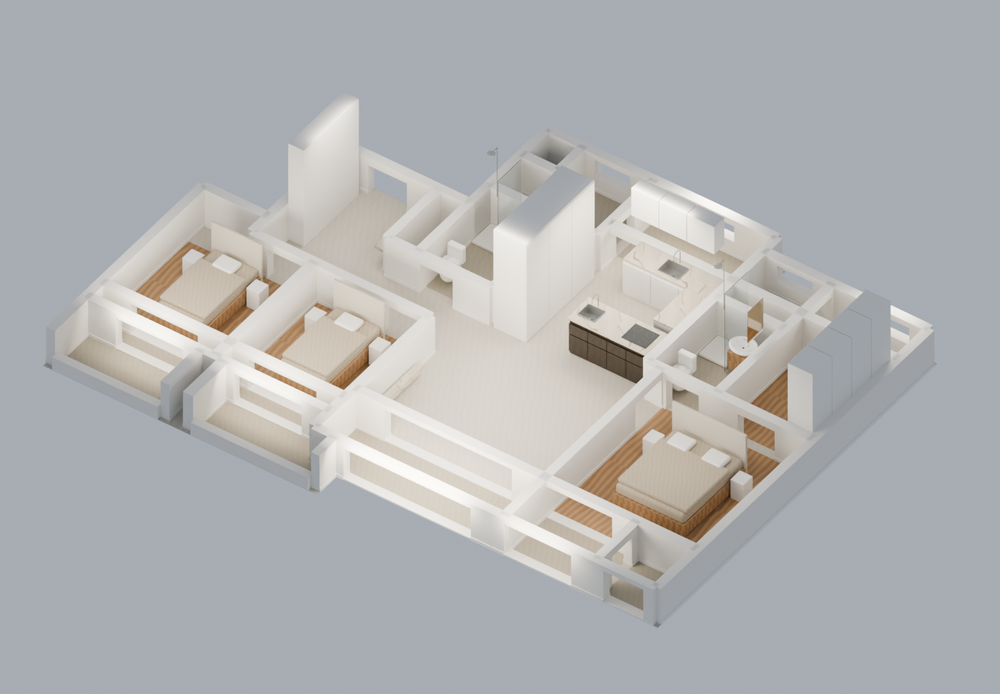
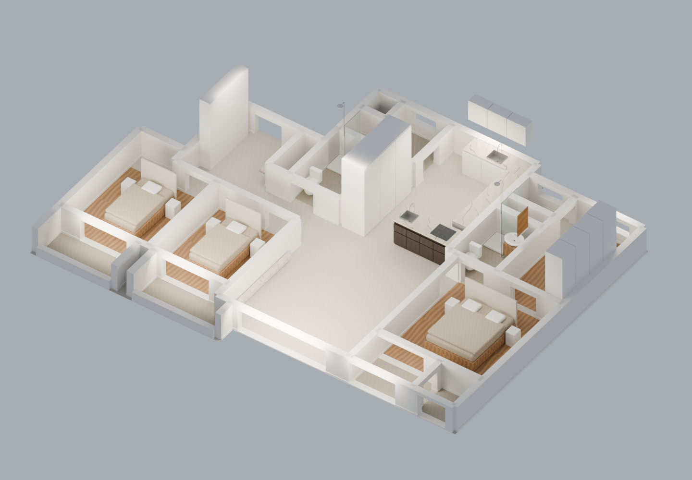

# 3DProperty

사진·평면도와 치수 정보를 활용한 편집 가능한 3D 공간 모델링 프로젝트입니다.

## 현재 공유 모델

**[아크로리버파크 112A · 기본형/확장형 · dimensioned-v1](assets/models/acro-river-park/112a/dimensioned-v1/README.md)**

치수 기반 Blender 파일 두 개와 조감도, 치수 도면, CSV, 검증 기록을 공유합니다. 원하는 `.blend` 파일을 내려받아 Blender에서 열면 됩니다. 텍스처는 파일에 포함되어 있습니다.

| 기본형 | 확장형 |
| --- | --- |
|  |  |

## 폴더 구조

```text
assets/
  models/
    acro-river-park/
      112a/
        dimensioned-v1/
          README.md
          manifest.json
          calibration.json
          comparison.json
          basic/       # 기본형 모델·미리보기·치수·검증
          expanded/    # 확장형 모델·미리보기·치수·검증
docs/
  repository-structure.md
```

자세한 추가·수정 기준은 [레포 구조 안내](docs/repository-structure.md)를 참고하세요. 실제 건물 실측 정확도와 미표기 높이 등은 각 모델 README의 범위를 확인해야 합니다.
