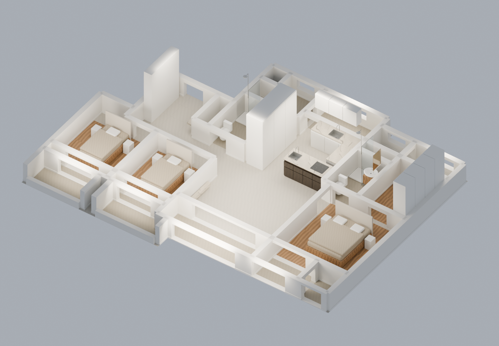
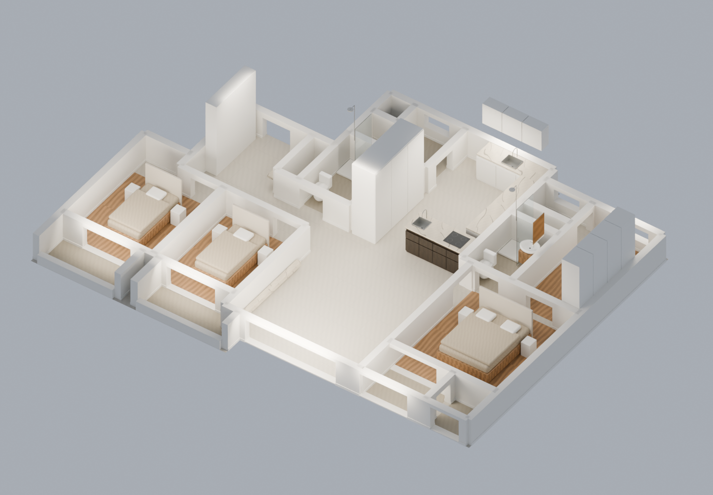

# 3DProperty

사진·평면도와 치수 정보를 활용한 편집 가능한 3D 공간 모델링 프로젝트입니다.

## 웹 개발 시작하기

Node.js 20.19 이상이 필요합니다. Blender나 MCP 없이 포함된 GLB로 실행할 수 있습니다.

```bash
git clone https://github.com/JaeWook-S/3DProperty.git
cd 3DProperty
npm ci
npm run dev
```

별도 터미널에서 서비스 화면도 실행합니다.

```bash
cd 3DProperty/apps/web
npm ci
npm run dev
```

- 서비스 화면: http://localhost:5185 — 공간 선택과 가구 JSON 확인. 웹 틀은 `apps/web/src/main.js`, `style.css`에서 이어 개발합니다.
- 공간 뷰어: http://localhost:5173 — Three.js 이동·문 상호작용·마감·조명. 코드는 `src/walkthrough/`에 있습니다.
- 거실 배치: http://localhost:5173/?variant=expanded&view=living — 확장형 거실에 상품 규격 소파·스툴을 고정 배치했습니다.

두 화면은 직접 링크로 연결됩니다. 가구 드래그 배치, 앱에서 뷰어로 가구 전송, 추론 API와 서버 저장은 아직 구현하지 않았습니다. 주소 설정은 `apps/web/.env.example`, 인터페이스와 후속 작업은 [웹 연동 문서](docs/web-integration.md)를 참고하세요.

각 앱 폴더에서 `npm test`와 `npm run build`로 확인합니다. 브라우저 검사는 `npx playwright install chromium` 후 `npm run test:browser`로 실행합니다. 서비스 앱 브라우저 검사에는 5173 뷰어도 필요합니다. 비공개 S2 자료가 필요한 검사는 해당 환경 변수가 없으면 skip됩니다.

## 포함된 가구

`assets/furniture/catalog-sofa2790-stool980-v1/`에 개별 GLB, 거실 배치 GLB와 치수 manifest가 있습니다. 소파는 2790×1170×730mm, 스툴은 980×700×400mm입니다. 상품 이미지 표기 치수를 사용했으며 독립 실측은 아닙니다. 미표기 세부 형태는 근사했고 소파 높이 980mm 조절 상태는 구현하지 않았습니다.

## 웹 공간 체험 (PC)

기본형·확장형을 선택해 실제 미터 스케일로 불러와 1인칭으로 걸어볼 수 있습니다. 눈높이·시야각 조절, 벽·가구 충돌, 가까운 문 여닫기(E/클릭), 접촉 그림자를 적용했습니다. 낮·해질녘·밤 조명과 원본·오크·석재 마감, 울트라 화질을 선택할 수 있습니다.

```bash
npm ci
npm run dev
```

http://localhost:5173 에서 **공간에 들어가기** → WASD 이동·마우스 시선·Esc 해제. 서버 접속 방법, 설정 근거와 검증 범위는 [공간 체험 안내](docs/walkthrough.md)를 참고하세요.

## 현재 공유 모델

**[아크로리버파크 112A · 기본형/확장형 · dimensioned-v1](assets/models/acro-river-park/112a/dimensioned-v1/README.md)**

치수 기반 Blender 파일 두 개와 조감도, 치수 도면, CSV, 검증 기록을 공유합니다. 원하는 `.blend` 파일을 내려받아 Blender에서 열면 됩니다. 텍스처는 파일에 포함되어 있습니다.

| 기본형 | 확장형 |
| --- | --- |
|  |  |

## 폴더 구조

```text
assets/
  furniture/             # 규격 기반 가구와 거실 배치 GLB
  materials/             # 웹용 마감 텍스처
  models/
    acro-river-park/
      112a/
        dimensioned-v1/
          README.md
          manifest.json
          calibration.json
          comparison.json
          basic/       # 기본형 모델·미리보기·치수·검증
          expanded/    # 확장형 모델·미리보기·치수·검증
src/
  walkthrough/          # 미터 기반 PC 1인칭 웹 체험
apps/
  web/                  # 공간 선택·가구 결과 확인 서비스 화면
tests/                  # 이동·충돌·브라우저 검증
docs/
  repository-structure.md
  walkthrough.md        # 실행·조작·치수 기준
```

자세한 추가·수정 기준은 [레포 구조 안내](docs/repository-structure.md)를 참고하세요. 실제 건물 실측 정확도와 미표기 높이 등은 각 모델 README의 범위를 확인해야 합니다.
